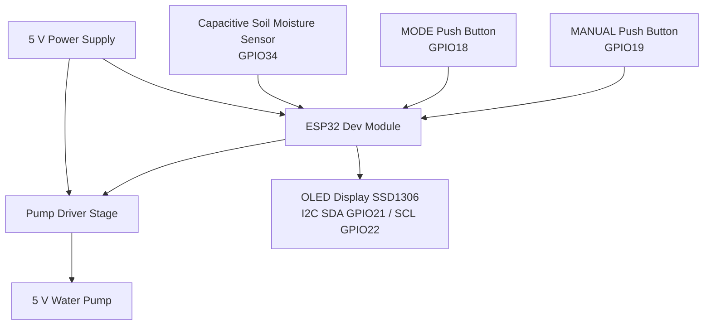
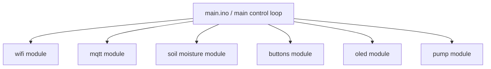
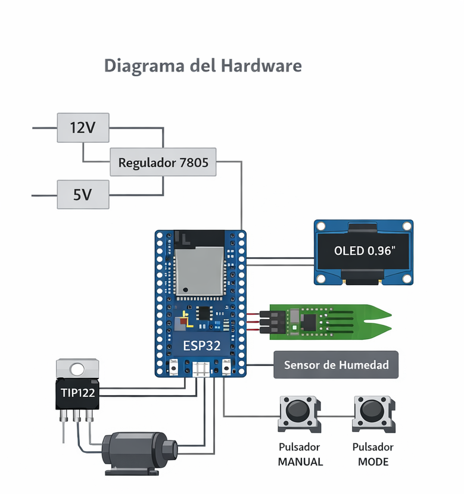
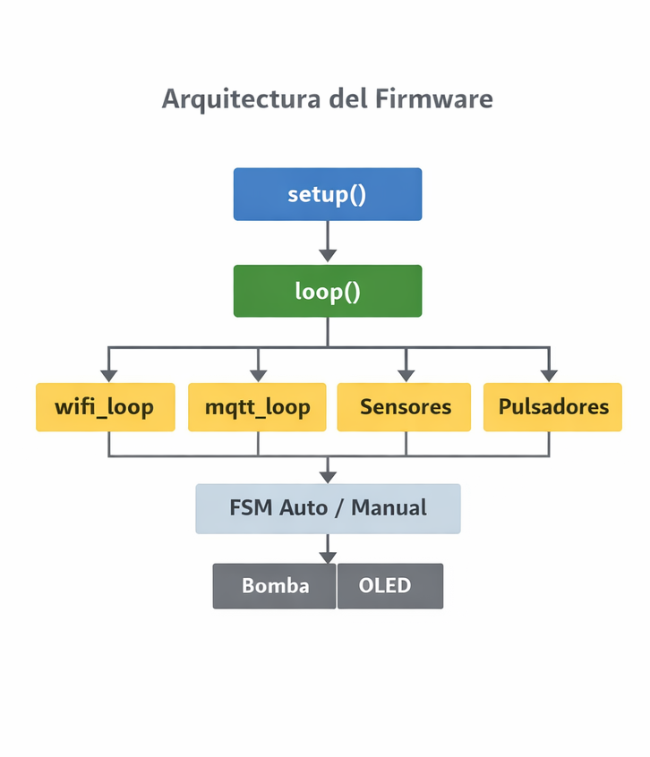

# ESP32 Smart Irrigation System

Project developed for the course **Electrónica II -- Embedded Systems**\
UTN FRRO -- Universidad Tecnológica Nacional.

This project implements an automatic irrigation system based on an ESP32
microcontroller.\
The system measures soil moisture and automatically activates a water
pump when the soil becomes dry.\
It also allows remote monitoring and control through MQTT from a mobile
device.

------------------------------------------------------------------------

# Features

-   Soil moisture measurement
-   Automatic irrigation control with hysteresis
-   Manual mode using push buttons
-   WiFi connectivity
-   MQTT communication
-   Remote monitoring from a mobile device
-   OLED display for local information
-   Configuration persistence
-   Serial configuration interface

------------------------------------------------------------------------

# Hardware Components

-   ESP32 Dev Module
-   Capacitive soil moisture sensor
-   5V DC water pump
-   TIP122 transistor driver
-   SSD1306 OLED display (I2C)
-   Push buttons (MODE / MANUAL)
-   Indicator LEDs:
    -   Power LED
    -   WiFi status LED
    -   Pump status LED
-   7805 voltage regulator
-   Flyback diode (1N4007)

------------------------------------------------------------------------

# Hardware Architecture

The hardware architecture is centered around the ESP32 microcontroller,
which reads the soil moisture sensor, processes user inputs from push
buttons, controls the irrigation pump through a transistor driver stage,
and displays system status on an OLED display.

------------------------------------------------------------------------

# Firmware Architecture

The firmware follows a modular architecture organized around the main
loop.\
Each module is responsible for a specific subsystem of the irrigation
controller.

------------------------------------------------------------------------

# Firmware Modules

-   **main.ino**\
    Main application entry point. Initializes all modules in `setup()`
    and executes the main control loop in `loop()`.

-   **wifi.cpp / wifi.h**\
    Manages WiFi connectivity and reconnection.

-   **mqtt.cpp / mqtt.h**\
    Handles MQTT communication, publishing system status and receiving
    commands.

-   **sensor_humedad.cpp / sensor_humedad.h**\
    Reads the capacitive soil moisture sensor and converts the analog
    signal into a humidity percentage.

-   **pulsadores.cpp / pulsadores.h**\
    Reads MODE and MANUAL push buttons and implements software debounce.

-   **bomba.cpp / bomba.h**\
    Controls the irrigation pump through a transistor driver.

-   **oled.cpp / oled.h**\
    Displays system information such as humidity, mode, WiFi status and
    pump state.

-   **config_pins.h**\
    Centralizes GPIO pin assignments.

-   **config_mqtt.h**\
    Stores MQTT broker configuration and topics.

------------------------------------------------------------------------

# System Operation

The system continuously reads the soil moisture sensor and decides
whether irrigation is required.

Two operating modes are available:

### Automatic Mode

The pump is automatically controlled based on soil humidity thresholds.

### Manual Mode

The user can manually activate or deactivate the pump using: - the
manual push button - MQTT commands from a mobile application

------------------------------------------------------------------------

# MQTT Communication

Broker used:

test.mosquitto.org

Topics used:

### Published topics

riego/humedad\
riego/bomba

### Subscribed topic

riego/comando

### Available commands

ON\
OFF\
AUTO

------------------------------------------------------------------------

# Serial Configuration

The system allows configuration through the serial monitor.

Example commands:

Change minimum humidity threshold:

hmin 30

Change maximum humidity threshold:

hmax 60

Change WiFi credentials:

ssid NetworkName\
pass Password

------------------------------------------------------------------------

# Automatic Control

The irrigation control uses **hysteresis** to prevent rapid switching.

-   If humidity \< minimum threshold → pump turns ON
-   If humidity \> maximum threshold → pump turns OFF

------------------------------------------------------------------------

# Mobile Control Panel

The **IoT MQTT Panel** mobile application was used for remote monitoring
and control.

The panel displays:

-   Soil moisture level
-   Pump status
-   Remote ON/OFF control

------------------------------------------------------------------------

# Pin Assignment

  Device                  ESP32 GPIO
  ----------------------- ------------
  Soil Moisture Sensor    GPIO34
  OLED SDA                GPIO21
  OLED SCL                GPIO22
  MODE Button             GPIO18
  MANUAL Button           GPIO19
  Pump Control (TIP122)   GPIO5
  WiFi LED                GPIO2
  Pump LED                GPIO16
  Power LED               3.3V

------------------------------------------------------------------------

# Figures

**Figure 1.** Hardware block diagram of the irrigation system.

**Figure 2.** Firmware architecture of the embedded system.

------------------------------------------------------------------------

# Prototype

**Figure 3.** Physical prototype of the irrigation controller PCB.

------------------------------------------------------------------------

# Author

**Javier Andrada**\
UTN FRRO\
Electrónica II -- Embedded Systems
